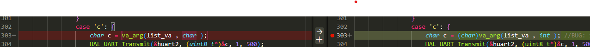

| Tên bug                | Date     | Mô tả                                                                         | Cách tái hiện | Cách sửa | Done |
|---------               |-------   |-------                                                                        |---------------|----------|------|
| TEMPLATE              |  NGÀY BUG     |    MÔ TẢ BUG                                                          |   QUY TRÌNH      |  SỬA NHƯ NÀO  |    XONG CHƯA  |
|variadic arguments      | 12/4/2026|Trong ngôn ngữ C, khi bạn truyền một đối số vào hàm có dấu ... (như printf hay hàm log của bạn), các kiểu dữ liệu nhỏ hơn int (như char, short) sẽ tự động được "nâng cấp" (Promotion) thành kiểu int.Lỗi đặc tả: Theo tiêu chuẩn C, bạn không được phép dùng char trong va_arg. Bạn phải dùng int.Cơ chế bộ nhớ: Khi bạn gọi va_arg(list_va, char), trình biên dịch sẽ cố gắng lấy 1 byte từ Stack. Tuy nhiên, kiến trúc ARM Cortex-M yêu cầu truy cập bộ nhớ phải căn lề (Alignment). Việc đọc sai kích thước dữ liệu trong va_list khiến con trỏ __ap bị lệch, dẫn đến việc truy cập vùng nhớ không hợp lệ ở các lệnh kế tiếp $\rightarrow$ HardFault.              |               |Bạn cần đổi char thành int, sau đó ép kiểu ngược lại về char nếu muốn.          |OK      |

