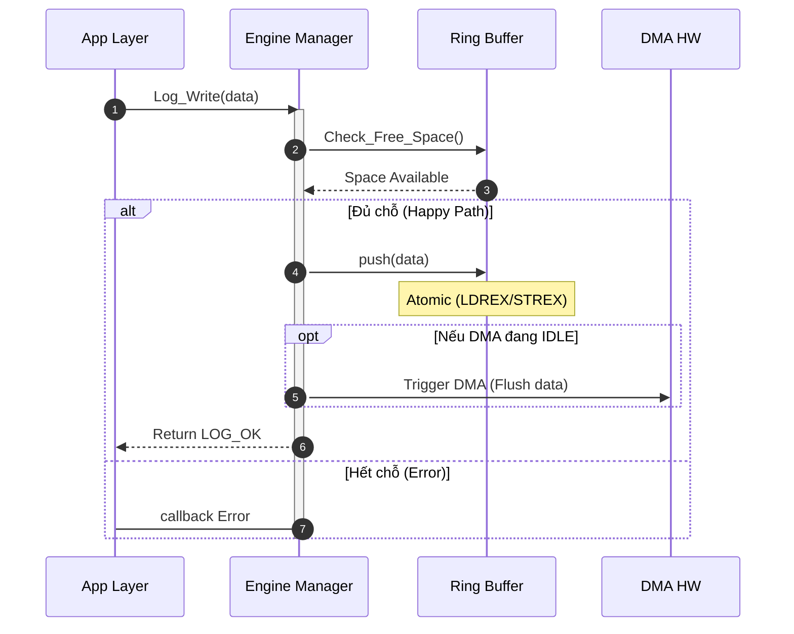

```mermaid
sequenceDiagram
    autonumber
    participant App as App Layer
    participant Eng as Engine Manager
    participant RB as Ring Buffer
    participant DMA as DMA HW

    App->>Eng: Log_Write(data)
    activate Eng

    Eng->>RB: Check_Free_Space()
    RB-->>Eng: Space Available

    alt Đủ chỗ (Happy Path)
        Eng->>RB: push(data)
        Note over RB: Atomic (LDREX/STREX)
        
        opt Nếu DMA đang IDLE
            Eng->>DMA: Trigger DMA (Flush data)
        end
        Eng-->>App: Return LOG_OK

    else Hết chỗ (Error)
        Eng->App: callback Error
    end

    deactivate Eng

```