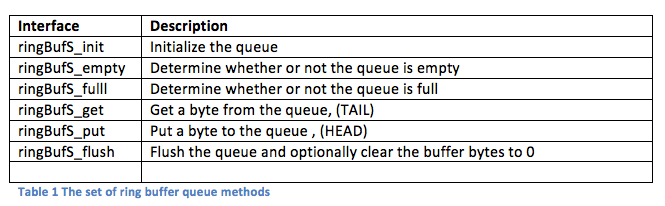

# RING BUFFER DOCS API

>  Giải thích các api của ring trong dự án này

## Mục lục
- [LIST API](#Api-List)
- [API Reference](#API-Reference)


## LIST API
## Ảnh chụp màn hình



## API Reference

### `ringBufS_init`

Initializes the ring buffer by zeroing all memory — clears `buf`, `head`, `tail`, and `count`.

```c
#include <string.h>
#include "ringBufS.h"

void ringBufS_init(ringBufS *_this)
{
    memset(_this, 0, sizeof(*_this));
}
```

> [!NOTE]
> This clears both the queue state **and** the buffer contents. Equivalent to a full reset.

---

### `ringBufS_empty`

Returns non-zero if the queue is empty.

```c
#include "ringBufS.h"

int ringBufS_empty(ringBufS *_this)
{
    return (0 == _this->count);
}
```

---

### `ringBufS_full`

Returns non-zero if the queue is full.

```c
#include "ringBufS.h"

int ringBufS_full(ringBufS *_this)
{
    return (_this->count >= RBUF_SIZE);
}
```

---

### `ringBufS_get`

Retrieves one byte from the tail of the queue. Returns `-1` if the queue is empty.

```c
#include "modulo.h"
#include "ringBufS.h"

int ringBufS_get(ringBufS *_this)
{
    int c;
    if (_this->count > 0)
    {
        c           = _this->buf[_this->tail];
        _this->tail = modulo_inc(_this->tail, RBUF_SIZE);
        --_this->count;
    }
    else
    {
        c = -1;
    }
    return (c);
}
```

> [!IMPORTANT]
> The return type is `int` (not `unsigned char`) to allow `-1` as an error sentinel for empty queue.

---

### `ringBufS_put`

Places one byte at the head of the queue. Silently drops the byte if the queue is full.

```c
#include "modulo.h"
#include "ringBufS.h"

void ringBufS_put(ringBufS *_this, const unsigned char c)
{
    if (_this->count < RBUF_SIZE)
    {
        _this->buf[_this->head] = c;
        _this->head = modulo_inc(_this->head, RBUF_SIZE);
        ++_this->count;
    }
}
```

> [!WARNING]
> Data is **silently dropped** when the buffer is full. Check `ringBufS_full()` before calling if data loss is unacceptable.

---

### `ringBufS_flush`

Resets `count`, `head`, and `tail` to zero. Optionally zeroes `buf` for diagnostic purposes.

```c
#include "ringBufS.h"

void ringBufS_flush(ringBufS *_this)
{
    _this->count = 0;
    _this->head  = 0;
    _this->tail  = 0;
    /* Optional: memset(_this->buf, 0, sizeof(_this->buf)); */
}
```

> [!TIP]
> Clearing `buf` is not required for correct operation but can help during debugging to avoid stale data confusion.

---

## Data Structure

```
RBUF_SIZE = 8 (example)

Index:  [ 0 ][ 1 ][ 2 ][ 3 ][ 4 ][ 5 ][ 6 ][ 7 ]
Data:   [ A ][ B ][ C ][ D ][   ][   ][   ][   ]
                              ^                ^
                             head             tail
                          (next write)    (next read)

count = 4
```

The `modulo_inc()` helper wraps the index around `RBUF_SIZE`, keeping reads and writes within bounds.

---

## Usage Example

```c
#include "ringBufS.h"

int main(void)
{
    ringBufS queue;
    ringBufS_init(&queue);

    /* Put bytes */
    ringBufS_put(&queue, 'H');
    ringBufS_put(&queue, 'i');

    /* Get bytes */
    int c;
    while (!ringBufS_empty(&queue))
    {
        c = ringBufS_get(&queue);
        /* process c */
    }

    /* Flush when done */
    ringBufS_flush(&queue);

    return 0;
}
```

---

## Dependencies

| File         | Purpose                              |
|--------------|--------------------------------------|
| `ringBufS.h` | Struct definition, `RBUF_SIZE` macro |
| `modulo.h`   | `modulo_inc()` for index wrapping    |
| `string.h`   | `memset()` used in `init`            |